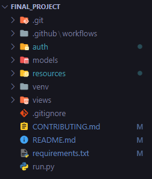
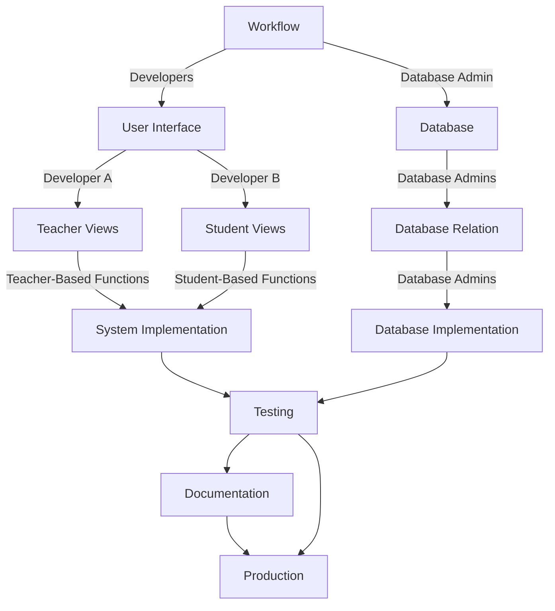
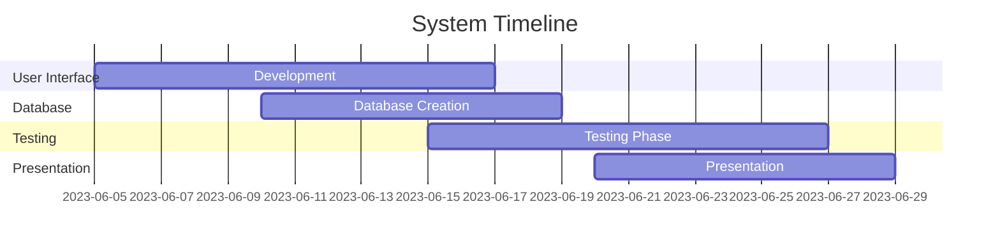

# Contributing

See [Table of contents](#tables) for references.

## Table of content 
- [1. Development](#development)
  - [1.1 File System](#file-system)
  - [1.2 Requirements](#requirements)
  - [1.3 Development Flow](#development)
  - [1.4 Timeline](#time)
- [2. Testing](##testing)
  - [2.1 Debugging](#debug)
  - [2.1 Linting](#lnit)
- [3. Documentation](#doc)
  
# File System
Overview of the project file system, as of 06/09/2023.

## File system heirarchies:

* `auth` : Contains all `.py files` required for the project database authentications.

* `models` : Contains all `.py files` required for database modelling.

* `resources` : Contains all sub-folder for `audio, fonts, icons, images`.

* `venv` : python virtual environment folder. Do not modify.
  
* `run.py` : Project runner file only. Reference to the main.py view.
* `markdowns` : Related markdowns or `.md` files like `Contributing.md` and `README.md`.

# Requirements
You should have these applications and tools to develop, test, and debug the project.

- XAMPP 8.2.4
- IDE/Editor
- MySQL
- Python 3.11.3
# Development
### Here is the general concept of the project implementation:

> NOTICE:  There are no detailed representations of the UI workflow, database guidelines, and their connections

## Sequence Diagram of Account Login/Signup

## Timeline Constraints
The project has a short timeline for development and testing that is why we must meet the timeline deadline as soon as possible. Here is a gantt chart representation based on [Project Paper - Gantt Chart](https://1drv.ms/w/s!AtjIPcaFwE3CgV4OqJ_29lvdOtQE?e=jBvQEl):

## Testing 
### Debugging
### Testing Environment

## Documentation
In progress